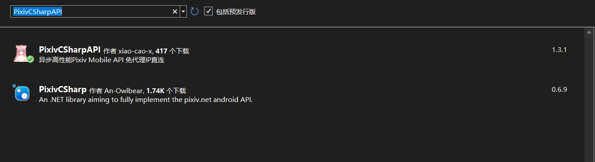

# 储存库

<a href="https://github.com/xiao-cao-x/pixiv-csharp-api" target="_blank">
    
</a>

## 特点

1. .NET 6.0
2. C# 10.0
3. 初始化和刷新AuthToken支持
4. WebView2登录支持
5. 免代理IP直连

## 使用方法

1. `NuGet` 搜索 `PixivCSharpAPI` 并安装  

2. 引入命名空间
```csharp
using PixivAPI;
```
3. 创建一个获取用户账号的函数  
```csharp
public UserAccountDTO GetUserAccount()
{
    return ...;
}
```
4. 创建`AuthClient`  
```csharp
var authClient = new AuthClient(GetUserAccount, new("zh-CN"));
```
5. 创建`ApiClient`  
```csharp
var apiClient = new ApiClient(authClient, new("zh-CN"));
```

