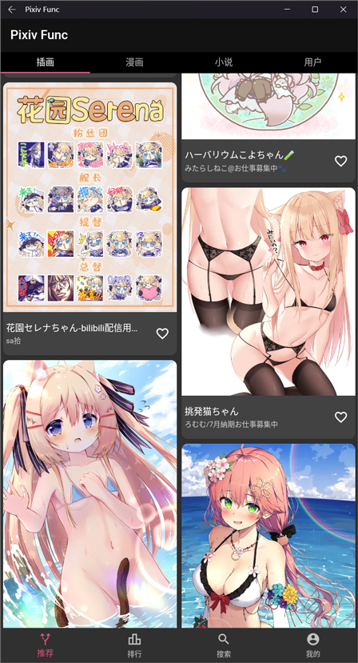
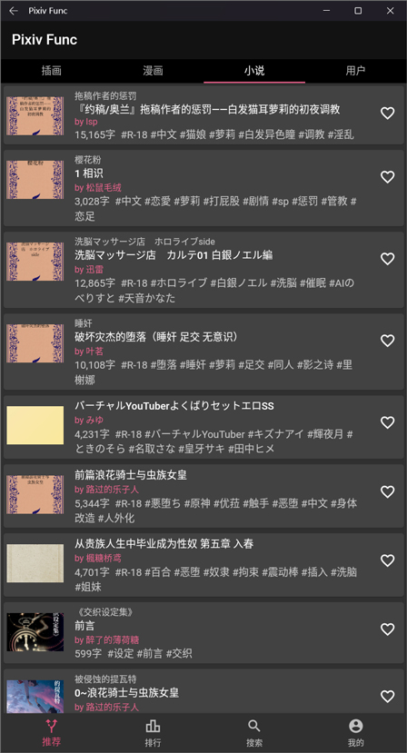
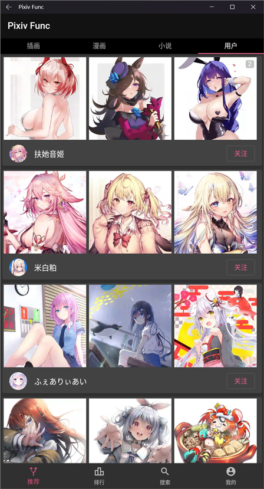
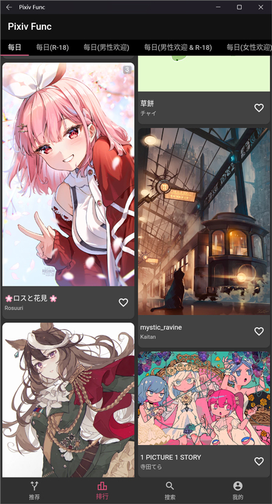
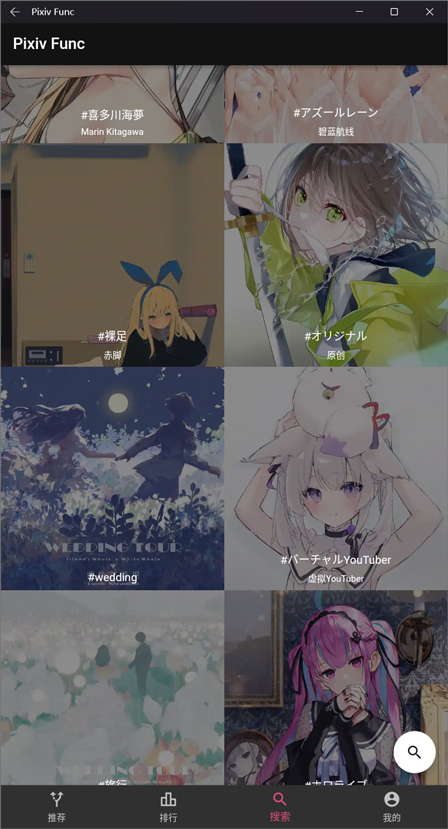
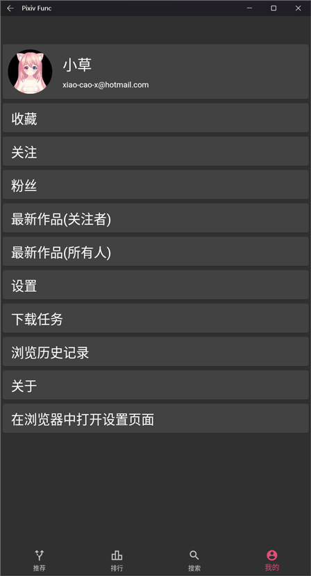
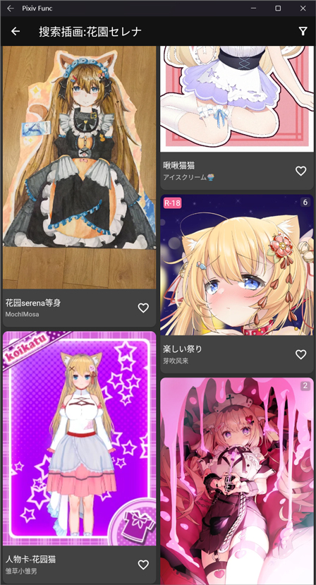
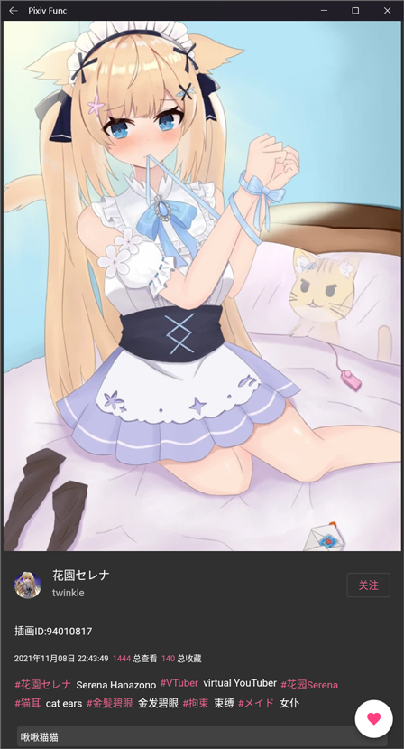
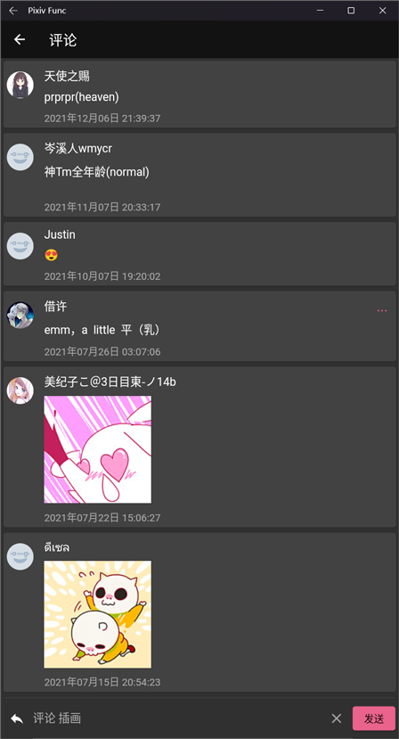
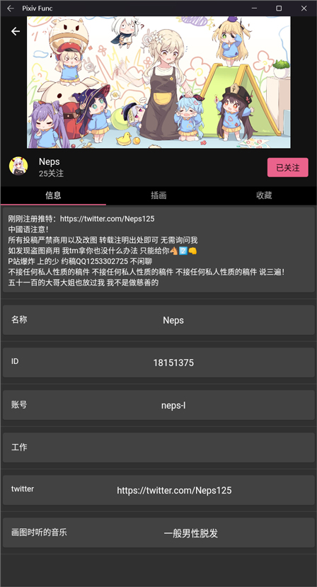

# 储存库

<h3>免代理直连不需要梯子也可以看P站</h3>
 

# 软件下载

#### 方法1 
前往 [GitHub Release](https://github.com/xiao-cao-x/pixiv_func_mobile/releases)

#### 方法2
点击下载
- [直接从GitHub下载(开了梯子用这个)](https://github.com/xiao-cao-x/pixiv_func_mobile/releases/latest/download/app-release.apk)
- [通过镜像站下载(国内或者没有梯子用这个)](https://ghproxy.com/https://github.com/xiao-cao-x/pixiv_func_mobile/releases/latest/download/app-release.apk)

# 预览

# 使用帮助

1. `插画页面`可以直接单击插画的标签来搜索`长按复制`  
2. `插画的留言和用户的留言中的蓝字和红字`可以直接点击跳转到APP(如Twitter)或者浏览器  
3. `搜索的输入框`输入数字时可以直接`搜索ID`
4. `搜索输入页面`有个按钮(`图片上有个放大镜`),点一下可以`上传图片搜索(图片搜源)`
5. `插画留言和用户留言`的那个`卡片`可以长按显示`原始内容`
6. `搜索`页面的`推荐标签卡片`单击可以直接`搜索标签`,长按可以进入预览图的`插画页面`
7. `收藏按钮(♥图标)`和关注用户按钮长按可以选择`悄悄收藏`或者`公开收藏`,单击是`公开收藏`
8. `评论页面`长按一条评论可以`回复`,点左下角的`返回箭头图标`可以返回到`评论插画`,默认是评论插画
9. `评论页面`评论后面有个`半截省略号(…)`的,可以点一下加载评论的回复

# 注意事项

1. 本地反向代理绑定`12345`端口注意不要占用
2. 不能直连与地区和运营商有关

# 常见问题

## 不能登录/注册

#### 1. 白屏或者ERR_EMPTY_RESPONSE或者ERR_CONNECTION_TIME_OUT之类的错误
如果勾选了使用本地反向代理,那么确保你的`WebView`是`Android System WebView`并尝试刷新页面  
如果没有勾选,那么确保你的网络能直接访问`pixiv.net`(比如开了梯子)

#### 2. 点输入框能弹出键盘但是不能输入
确保你的`WebView`是`Android System WebView`  
尝试复制文字粘贴进输入框

#### 3. 点输入框弹出键盘的一瞬间又收回去了
确保你的`WebView`是`Android System WebView`  
多点几次快速的点,直到他不收回去为止(这个问题发生在我之前的`iqoo u1x(vivo)`手机上)

#### 4. 点输入框弹不出键盘
确保你的`WebView`是`Android System WebView`  
这个也是vivo手机上出现的问题,目前没有解决可以自行尝试

#### 5. Android System WebView 在哪下载?
1. `APKMirror`[https://www.apkmirror.com/apk/google-inc/android-system-webview](https://www.apkmirror.com/apk/google-inc/android-system-webview)
2. `Uptodown`[https://android-system-webview.cn.uptodown.com/android](https://android-system-webview.cn.uptodown.com/android)
3. `APK Pure`[https://apkpure.com/android-system-webview/com.google.android.webview](https://apkpure.com/android-system-webview/com.google.android.webview)
4. `Google Play`[https://play.google.com/store/apps/details?id=com.google.android.webview&hl=zh&gl=US](https://play.google.com/store/apps/details?id=com.google.android.webview&hl=zh&gl=US)

## 怎么没有R-18?

简单来说 你没开

开启方法

1. 点击`我的=>在浏览器中打开设置页面`根据情况选择是否启用本地反向代理,或者前往浏览器[https://www.pixiv.net/settings.php](https://www.pixiv.net/settings.php)
2. 找到`浏览限制=>有年龄限制的作品`移动端需要点进去,PC端直接修改
3. 修改完之后APP里就能看到R-18了

## 怎么下载图片?

长按即可,下载完成后会保存在系统相册的`PixivFunc`目录下

## 怎么让推荐里全是自己喜欢看的?

养号 收藏标签喜欢的作品

## R-18为什么很少?

移动端API就是这样的,可以找一张R-18的图点进去看推荐

## 浏览历史记录为什么什么都没有?

默认是关的,你需要去`我的=>设置=>浏览历史记录`中启用

## 怎么搜索?

`搜索`页面有个放大镜图标点一下进到输入页面 输入完内容按回车键搜索